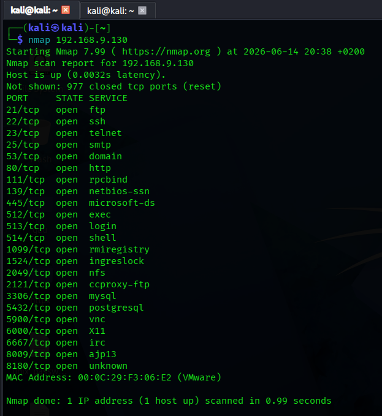

# Nmap Basic Scan - Metasploitable 2

**Date:** 2026-06-14
**Target:** Metasploitable 2
**IP:** 192.168.9.130
**Command:** `nmap 192.168.9.130`

## Results

| PORT     | STATE | SERVICE     |
|----------|-------|-------------|
| 21/tcp   | open  | ftp         |
| 22/tcp   | open  | ssh         |
| 23/tcp   | open  | telnet      |
| 25/tcp   | open  | smtp        |
| 53/tcp   | open  | domain      |
| 80/tcp   | open  | http        |
| 111/tcp  | open  | rpcbind     |
| 139/tcp  | open  | netbios-ssn |
| 445/tcp  | open  | microsoft-ds|
| 512/tcp  | open  | exec        |
| 513/tcp  | open  | login       |
| 514/tcp  | open  | shell       |
| 1099/tcp | open  | rmiregistry |
| 1524/tcp | open  | ingreslock  |
| 2049/tcp | open  | nfs         |
| 2121/tcp | open  | ccproxy-ftp |
| 3306/tcp | open  | mysql       |
| 5432/tcp | open  | postgresql  |
| 5900/tcp | open  | vnc         |
| 6000/tcp | open  | X11         |
| 6667/tcp | open  | irc         |
| 8009/tcp | open  | ajp13       |
| 8180/tcp | open  | unknown     |

## Key Observations

- 23 open ports discovered
- Port 1524 (ingreslock) is a known backdoor
- Legacy services (telnet, exec, login, shell) present

## Next Steps

Run `nmap -sV 192.168.9.130` for version detection
