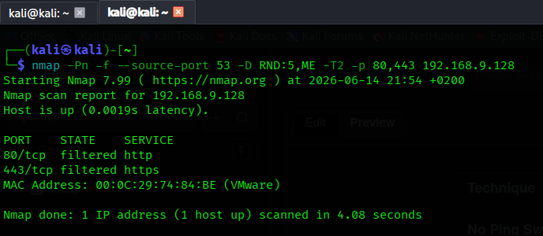

# Nmap Firewall Evasion and Metasploitable 3 Analysis

This repository contains technical documentation analyzing the effectiveness of network-layer firewall evasion techniques against a hardened target environment.

## Environment Setup

* **Date:** 2026-06-14
* **Target:** Metasploitable 3 (Windows VM)
* **IP Address:** 192.168.9.128
* **Firewall Configuration:** Windows Defender Firewall (Enabled)
* **Scenario:** Initial reconnaissance shows standard scan ports as filtered.

---

## The Problem: Baseline Scan

A standard TCP SYN stealth scan was executed to probe the target host:

```bash
nmap -sS 192.168.9.128
```

**Result:** The majority of common ports returned a `filtered` state. This indicates that the Windows Defender firewall dropped the packets without returning an `RST` response.

---

## Combined Evasion Probe

To attempt to bypass the filtering rules, a tailored evasion scan string was executed:

```bash
nmap -Pn -f --source-port 53 -D RND:5,ME -T2 -p 80,443 192.168.9.128
```

### Raw Scan Output
```text
Starting Nmap 7.99 ( https://nmap.org ) at 2026-06-14 21:54 +0200
Nmap scan report for 192.168.9.128
Host is up (0.0019s latency).

PORT    STATE    SERVICE
80/tcp  filtered http
443/tcp filtered https
MAC Address: 00:0C:29:74:84:BE (VMware)

Nmap done: 1 IP address (1 host up) scanned in 4.08 seconds
```

---

## Evasion Techniques Breakdown

| Technique | Command Flag | Status | Technical Cause |
| :--- | :--- | :--- | :--- |
| **No Ping Sweep** | `-Pn` | Partially Successful | Skips host discovery. Uncovers the host but fails to unfilter ports. |
| **Packet Fragmentation** | `-f` | Failed | Modern stateful firewalls reassemble fragments at the boundary layer before inspection. |
| **Source Port Spoofing** | `--source-port 53` | Failed | The firewall checks state tables; it does not automatically trust incoming traffic from standard ports like DNS. |
| **Decoy Scanning** | `-D RND:5,ME` | Failed | Obfuscates the true scanner identity in logs but does not change packet filtering behavior. |
| **Polite Timing** | `-T2` | Failed | Slower packet serialization bypasses rate-limiting alerts, but still triggers basic static rule blocks. |

---

## Key Takeaways and Lessons Learned

* **Filtered Indicators:** A `filtered` port state confirms the host is active, but an explicit access control rule is actively dropping traffic.
* **Modern Hardening:** Default Windows Defender configurations successfully mitigate classic network-layer evasion tactics. 
* **Defense in Depth:** Effective evasion requires looking legitimate to application logic rather than attempting packet obfuscation at the network layer.

## Next Steps

Because network-layer evasion was unsuccessful, the testing scope will pivot to high-value application layers:
1. Identifying underlying web application vulnerabilities on accessible channels.
2. Formulating application-specific payloads.
3. Exploring client-side vectors and configurations.

---

## Scan Verification


