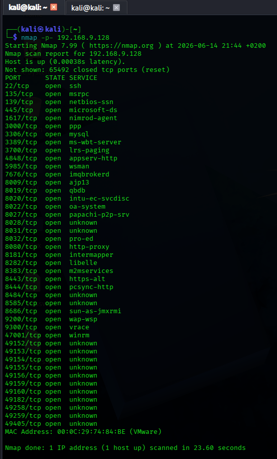

# Nmap Full Port Scan - Metasploitable 3 (Firewall Disabled)

**Date:** 2026-06-14
**Target:** Metasploitable 3 (Windows VM)
**IP:** 192.168.9.128
**Command:** `nmap -p- 192.168.9.128`

## Screenshot

## Results (Selected Open Ports)

| PORT      | STATE | SERVICE           |
|-----------|-------|-------------------|
| 22/tcp    | open  | ssh               |
| 135/tcp   | open  | msrpc             |
| 139/tcp   | open  | netbios-ssn       |
| 445/tcp   | open  | microsoft-ds      |
| 3306/tcp  | open  | mysql             |
| 3389/tcp  | open  | ms-wbt-server     |
| 5985/tcp  | open  | wsman             |
| 8080/tcp  | open  | http-proxy        |
| 8443/tcp  | open  | https-alt         |
| 47001/tcp | open  | winrm             |
| 49152-49405| open | various (RPC/DCOM)|

## Key Observations

- **Firewall was disabled** for this scan
- Much more open ports than before (40+)
- Key services: SSH (22), RDP (3389), MySQL (3306), WinRM (5985)
- SMB ports (139, 445) open — potential for lateral movement

## What I Learned

- Firewall makes a HUGE difference
- With firewall off, Windows reveals many services
- Full scan of 65k ports took 23 seconds
- `-p-` scans all ports, not just top 1000

## Next Steps

- Test WinRM with `evil-winrm`
- Check MySQL default credentials
- Enumerate SMB shares
- Scan with `-sV` to identify versions
