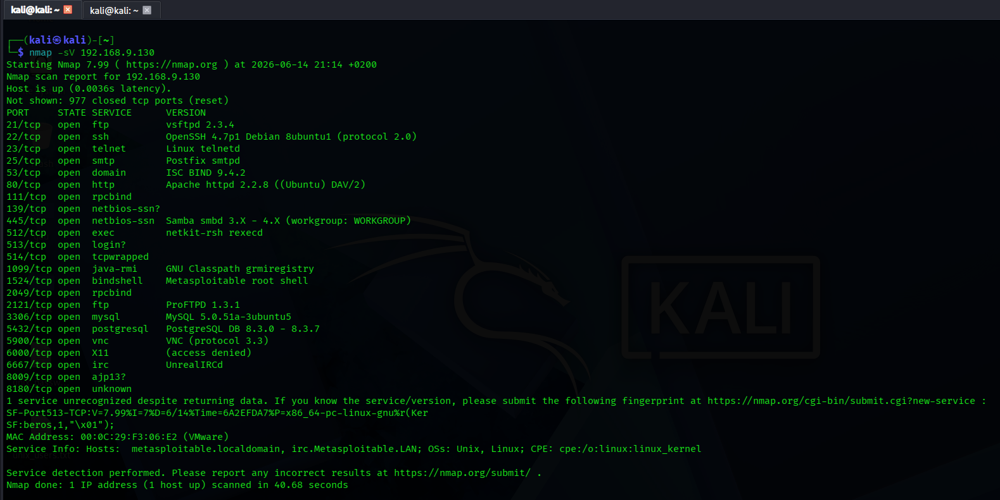

# Nmap Service Detection - Metasploitable 2

**Date:** 2026-06-14
**Target:** Metasploitable 2
**IP:** 192.168.9.130
**Command:** `nmap -sV 192.168.9.130`

## Screenshot

## Results

| PORT     | STATE | SERVICE      | VERSION |
|----------|-------|--------------|---------|
| 21/tcp   | open  | ftp          | vsftpd 2.3.4 |
| 22/tcp   | open  | ssh          | OpenSSH 4.7p1 Debian 8ubuntu1 |
| 23/tcp   | open  | telnet       | Linux telnetd |
| 25/tcp   | open  | smtp         | Postfix smtpd |
| 53/tcp   | open  | domain       | ISC BIND 9.4.2 |
| 80/tcp   | open  | http         | Apache httpd 2.2.8 |
| 111/tcp  | open  | rpcbind      | - |
| 139/tcp  | open  | netbios-ssn  | Samba smbd 3.X - 4.X |
| 445/tcp  | open  | netbios-ssn  | Samba smbd 3.X - 4.X |
| 512/tcp  | open  | exec         | netkit-rsh rexecd |
| 513/tcp  | open  | login        | - |
| 514/tcp  | open  | tcpwrapped   | - |
| 1099/tcp | open  | java-rmi     | GNU Classpath grmiregistry |
| 1524/tcp | open  | bindshell    | Metasploitable root shell |
| 2049/tcp | open  | rpcbind      | - |
| 2121/tcp | open  | ftp          | ProFTPD 1.3.1 |
| 3306/tcp | open  | mysql        | MySQL 5.0.51a-3ubuntu5 |
| 5432/tcp | open  | postgresql   | PostgreSQL DB 8.3.0 - 8.3.7 |
| 5900/tcp | open  | vnc          | VNC protocol 3.3 |
| 6000/tcp | open  | X11          | access denied |
| 6667/tcp | open  | irc          | UnrealIRCd |
| 8009/tcp | open  | ajp13        | - |
| 8180/tcp | open  | unknown      | - |

## Critical Vulnerabilities Identified

| Port | Service | Version | Known Vulnerability |
|------|---------|---------|---------------------|
| 21 | vsftpd | 2.3.4 | Backdoor command execution (CVE-2011-2523) |
| 22 | OpenSSH | 4.7p1 | Multiple old vulnerabilities |
| 1524 | bindshell | - | Direct root shell (no authentication) |
| 2121 | ProFTPD | 1.3.1 | Known remote exploits |
| 3306 | MySQL | 5.0.51a | Default credentials root:root |
| 6667 | UnrealIRCd | - | Backdoor vulnerability |

## Key Observations

- **vsftpd 2.3.4** has a known backdoor (CVE-2011-2523)
- **Port 1524 (bindshell)** gives root shell with `nc 192.168.9.130 1524`
- **Samba version** is vulnerable to remote code execution
- **VNC** may have weak password
- Service versions are extremely outdated (2007-2011 era)

## What I Learned

- `-sV` flag reveals software versions
- Old versions = easy targets
- Multiple services have public exploits
- This machine is designed for training penetration testers

## Next Steps

- Exploit vsftpd 2.3.4 using Metasploit
- Connect to port 1524 bindshell
- Crack MySQL credentials
- Investigate Samba vulnerability
